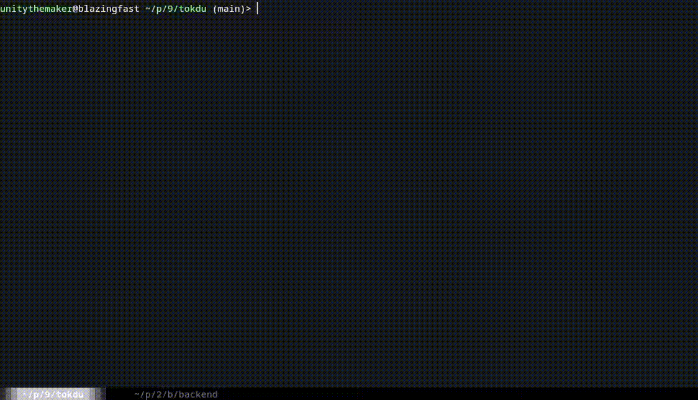

# tokdu - Token Disk Usage Analyzer for LLMs

`tokdu` (Token Disk Usage) is a terminal-based utility that helps you analyze and visualize token usage in your codebase. Similar to the classic `du` (disk usage) command, tokdu shows you how many tokens your files and directories consume, which is essential when working with Large Language Models (LLMs) that have token limits.

[](assets/tokdu-demo.mp4)

## Features

- 📊 Visualize token distribution across your project
- 🚀 Fast, asynchronous scanning with caching
- 🔍 Respects `.gitignore` rules
- ⏩ Skips binary files automatically
- 🧩 Uses OpenAI's `tiktoken` for accurate token counting
- 🎛️ Support for different models' tokenizers

## Installation

```bash
pip install tokdu
```

Or install from source:

```bash
git clone https://github.com/unitythemaker/tokdu.git
cd tokdu
pip install .
```

## Usage

Basic usage:

```bash
tokdu
```

This will start tokdu in the current directory.

Specify a starting directory:

```bash
tokdu /path/to/project
```

Use a specific tokenizer encoding:

```bash
tokdu --encoding cl100k_base
```

Use tokenization based on a specific model:

```bash
tokdu --model gpt-4o
```

## Navigation Controls

- **↑/↓ or j/k**: Navigate up/down
- **Enter**: Open selected directory
- **Backspace**: Go to parent directory
- **Page Up/Down**: Scroll by page
- **q**: Quit

## Why Count Tokens?

Large Language Models like GPT-4o have context window limits measured in tokens. When embedding code in prompts or using tools and IDEs like GitHub Copilot or Zed, understanding your project's token usage helps you:

- Stay within context window limits
- Optimize prompts for LLMs
- Identify areas to trim when sharing code with AI assistants

## Technical Details

- Uses OpenAI's `tiktoken` library for accurate token counting
- Tokenizers can be specified with either `--encoding` or `--model` flags
- Defaults to `o200k_base` encoding or `gpt-4o` model when not specified
- Scans directories asynchronously for better performance
- Caches results to avoid repeated scans

## Requirements

- Python 3
- tiktoken
- pathspec
- curses (built into Python standard library)

## License

MIT

## Author

Halil Tezcan KARABULUT ([@unitythemaker](https://github.com/unitythemaker))
